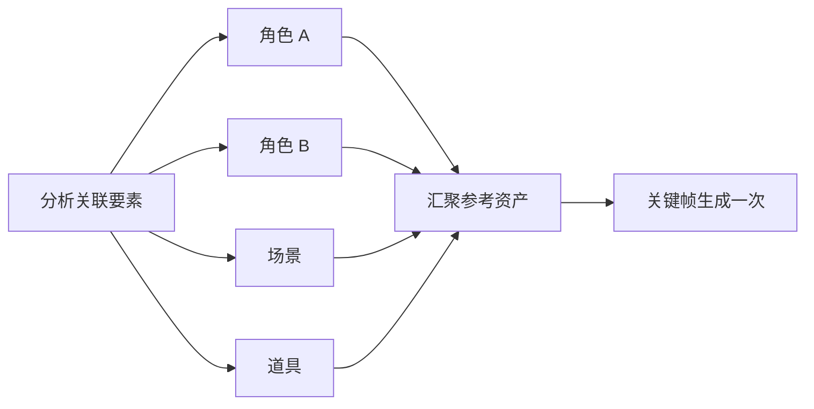
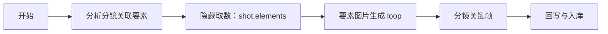
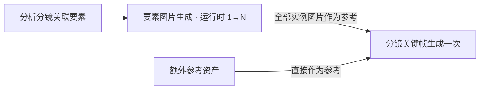

# Tapflow 动态循环、扇出与汇聚设计

> 日期：2026-08-01  
> 状态：阶段一已落地；高级连线交互和完整运行态独立子卡待后续会话继续。

## 1. 背景

分镜关键帧生成并不是简单的三节点串行任务。模板定义可以保持：

1. 分析分镜关联要素；
2. 生成要素图片；
3. 生成分镜关键帧。

但第二步的真实执行数量由第一步的结果决定。一个分镜可能关联多个角色、场景、道具和额外参考，因此运行时应将“要素图片生成”展开为 N 个实例，全部完成后再汇聚到关键帧节点。

这不是让工作流图形成有向环，而是通用的 `foreach / fan-out / fan-in` 数据流语义。



## 2. 设计结论

不在图片节点上增加“多点/单点”开关。

原因：

- 循环不是图片节点专属能力；视频、音频、文本和子工作流同样可能逐项执行。
- “多张图片”存在两种相反语义：逐张生成多个产物，或者作为多张参考只生成一个产物。
- 节点级二元开关无法表达“某个输入逐项展开，另一个输入整体聚合”。

循环语义应属于输入映射/连线，节点只声明输入端口接受单值还是集合。

## 3. 连线映射语义

工作流边允许声明以下映射：

| mapping | 含义 | 示例 |
|---|---|---|
| `auto` | 根据来源和目标端口类型自动判断 | 普通单值传递 |
| `each` | 来源集合逐项展开目标执行实例 | `elements[] → element_image.item` |
| `collect` | 等待上游全部完成并聚合为集合 | `element_image.image[] → keyframe.reference_images` |

示例：

```json
{
  "from": "elements",
  "to": "each_element",
  "mapping": "each"
}
```

```json
{
  "from": "each_element",
  "to": "keyframe",
  "mapping": "collect"
}
```

### 自动推导规则

1. 单值到单值：单次执行。
2. 集合到单项端口：推导为 `each`。
3. 集合到集合端口：推导为 `collect`。
4. 多条边进入集合端口：去重后聚合。
5. 来源或目标类型不明确：保持 `auto` 并在编排校验中提示，不静默猜测。
6. 用户只在歧义场景点击连线覆盖为“逐项运行”或“整体传入”。

阶段一只完成后端图字段的保存与透传；连线上的可视标签和覆盖菜单留待后续实现。

## 4. 后端执行模型

后端沿用已有 `loop` 节点：

```json
{
  "id": "each_element",
  "type": "loop",
  "config": {
    "source": "{{elements.items}}",
    "body": ["ensure_sheet"],
    "concurrency": 4
  }
}
```

运行规则：

1. 解析 `source`，必须得到数组。
2. 每个元素绑定到 `ctx.__item__`。
3. 每轮执行同一组 `body` 节点，并用 `iteration` 区分运行记录。
4. `concurrency` 控制最大并发数，范围限制为 1–8；未声明时为 1，保持旧流程行为。
5. 单个实例失败会记录错误并继续其他实例。
6. `loop` 返回有序 `results`、总数 `count` 和失败数 `failed`。
7. `loop` 整体返回后才执行下游，天然形成 fan-in 屏障。

### 并发子流程安全

循环体可能是 `subflow`。并发时不能再通过“查询父 run 下最新子 run”确定归属，否则不同 iteration 会串号。阶段一已经改为：先创建精确的子 run，拿到 ID 后再执行，并把该 ID 写入对应的 `workflow_node_runs.subrun_id`。

## 5. 编排态与运行态

### 编排态

- `loop` 投影为一张通用“逐项运行”母卡。
- 母卡显示集合来源、并发数和循环体定义。
- 循环体节点由母卡拥有，不再作为没有连线的孤立生成卡显示。
- 保存画布时仍保留隐藏的循环体后端节点，避免破坏工作流定义。

### 运行态

- API 返回节点运行记录的 `inputs`，其中 loop 记录包含本轮 `item`。
- 前端按照 `node_key + iteration` 识别实例。
- 母卡内显示每个实例的名称、状态、缩略图和错误。
- 状态包括：生成中、完成、复用已有产物、失败。
- 母卡汇总实例总数与完成数。

阶段一采用“母卡内实例列表”，避免大量要素立即撑爆无限画布。后续可增加点击母卡后展开为独立子卡，并由临时运行边连接到下游；这些运行态节点不得写回模板 graph。

## 6. 分镜关键帧模板

`shot-keyframe-canvas` 更新为：



其中：

- `shot.elements` 提供 `items[]`，画布隐藏并自动桥接连线。
- `ensure_sheet` 是 loop body，调用 `element-sheet` 子工作流。
- `element-sheet` 自己负责“已有设定图则跳过”，缺才跑语义不重复实现。
- loop 并发上限为 4。
- loop 完成后，关键帧装配器从统一参考关系重新解析最新图片，再生成关键帧。

## 7. 失败策略

当前兼容策略：单个循环实例失败不终止其他实例，loop 返回 `failed` 数量并进入下游。

后续应在 loop 配置增加明确策略：

```json
{
  "failure_policy": "required_blocks_optional_warns"
}
```

建议规则：

- 必需角色、场景失败：阻断关键帧节点。
- 道具或额外参考失败：警告后继续。
- 普通重跑：只重跑失败或缺失实例。
- 强制重跑：重跑所有实例。
- 下游节点应能读取 `loop.failed` 和失败项明细，不能只得到空参考列表。

## 8. 阶段一代码落点

- `backend/app/services/workflow.py`
  - loop 支持 `concurrency` 受控并发；
  - 保持结果顺序；
  - 返回失败数；
  - 修复并发 subflow 的 `subrun_id` 归属。
- `backend/app/api/workflows.py`
  - 节点运行明细增加 `inputs`。
- `backend/sql/68_workflow_keyframe_dynamic_elements.sql`
  - 幂等更新关键帧模板为动态要素循环。
- `frontend/src/lib/tapflowData.ts`
  - 增加通用 `loop` 节点和 `auto/each/collect` 边语义。
- `frontend/src/lib/tapflowGraphAdapter.ts`
  - 正确投影 loop，并隐藏其 body。
- `frontend/src/lib/tapflowGraphWrite.ts`
  - 保存 loop 配置、循环体和边 mapping。
- `frontend/src/lib/useTapflowRun.ts`
  - 按 iteration 投影运行实例。
- `frontend/src/features/tapflow/TapflowNode.tsx` / `tapflow.css`
  - 展示循环母卡和实例状态。

## 9. 后续缺口

1. 为节点输入/输出补正式的单值/集合 schema，目前自动推导还不能完全依赖类型系统。
2. 连线显示“逐项运行 / 合并为参考 / 单次传递”标签。
3. 连线歧义时的覆盖菜单与编排校验提示。
4. 点击 loop 母卡展开独立运行子卡和临时运行边。
5. 支持必需/可选要素及 `failure_policy`。
6. 支持仅重跑失败 iteration，并在 run options 中记录实例级 force。
7. 预检阶段展示预计实例数和已有/缺失数量。
8. 对大集合增加分页、折叠和最大实例保护。

## 10. 验收标准

- 打开包含 loop 的旧工作流时，loop 不再被误画成普通图片节点。
- 保存后 `type=loop`、`source`、`body`、`concurrency` 不丢失。
- 循环体节点不会作为孤立节点出现在编排画布，但仍保留在 graph 中。
- 4 个要素运行时能产生 4 组不同 iteration 的记录。
- 并发度不超过模板配置，结果顺序与输入顺序一致。
- 已有设定图实例显示“复用”，缺失实例真实生成。
- 所有实例结束后关键帧节点才开始。
- 运行母卡能展示实例名称、状态、产物或错误。
- 多个并发 subflow 的 `subrun_id` 分别指向正确的子 run。
- 老工作流未声明 `concurrency` 时仍按串行执行。

## 11. 分镜关键帧定稿：不增加汇聚节点

分镜关键帧画布不投影“自动汇聚”卡片。循环实例图片和额外参考图片就是关键帧生成
节点的直接上游参考，画布只显示真实业务节点：



`collect` 只属于连线和调度语义：下游等待全部实例结束、递归读取循环/子工作流产物、
按 URL 去重，然后只运行一次。它不得被投影成可见节点。任一必需要素实例失败时，
关键帧节点必须阻断并显示失败来源，不能绕过参考继续生成。
